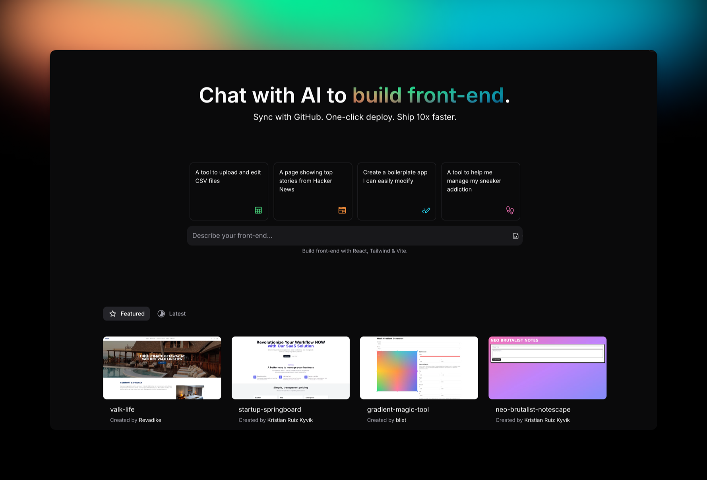

# :wave: Welcome to GPT Engineer Docs

GPT Engineer is an AI web builder app that lets you build real web apps fast, using just natural language. We prepared this documentation to make it even easier for you to go from an idea to an app and to understand how GPT Engineer works.

## Product Capabilities

**GPT Engineer** currrently excels at building front-end applications. However, pairing GPT Engineer with other tools will allow you to build full-stack web apps.

| **Capability**     | **Description**                                                              | **Maturity Level** |
|--------------------|------------------------------------------------------------------------------|--------------------|
| Frontend / UI      | Build user interfaces & frontend                                           | 🟢 Mature           |
| Persistence        | Store and retrieve data (read more [here](integrations/supabase.md#adding-data))         | 🟡 Alpha             |
| Authentication     | Handle user login and accounts (read more [here](integrations/supabase.md#supabase-authentication))  | 🟡 Alpha             |

## Overview
Explore the sections below to get started quickly and learn more about the features and integrations offered by GPT Engineer.

-   :octicons-zap-24:{ .lg .middle } **Getting started**

    ---

    Check out our Getting started guide for a simple introduction to key features and concepts.

    [:octicons-arrow-right-24: Getting started](getting-started.md)

-   :octicons-tools-24:{ .lg .middle } **Features overview**

    ---

    From a general overview to our GitHub integration, this section covers the nuts and bolts of GPT Engineer.

    [:octicons-arrow-right-24: Features](features/index.md)

-   :octicons-link-24:{ .lg .middle } **Integrations**

    ---

    Go beyond default features by integrating with third parties like Supabase. More coming in the future.

    [:octicons-arrow-right-24: Integrations](integrations/supabase.md)

-   :octicons-light-bulb-24:{ .lg .middle } **Tips and tricks**

    ---

    Learn effective prompting strategies and get the most out of GPT Engineer with our tips and tricks collection.

    [:octicons-arrow-right-24: Tips and tricks](tips-tricks/prompting.md)

---

## Learn more
You can learn more about GPT Engineer on our <a href="https://gptengineer.app" target="_blank" rel="noopener noreferrer">website</a>.
  
Discover the team behind GPT Engineer and our mission to make web development accessible to everyone. Learn more about the creators at <a href="https://lovable.dev" target="_blank" rel="noopener noreferrer">:heart: Lovable</a>.

---

## Stay connected

Join our community on <a href="https://discord.gg/rPw2rSFE2K" target="_blank" rel="noopener noreferrer">Discord</a> to stay updated on development, feature releases, and to connect with fellow users. Follow us on <a href="https://twitter.com/Lovable_dev" target="_blank" rel="noopener noreferrer">Twitter/X</a> for the latest updates and announcements.

---

## Feedback

We also value your feedback and we use both email and Discord for getting your feedback! 

### Email
If you want to share it with us, feel free to email us at <a href="mailto:feedback@gptengineer.app">feedback@gptengineer.app</a>.

### User-feedback channel
[:simple-discord: User-feedback channel on Discord](https://discord.com/channels/1119885301872070706/1192445544375799920)

If Discord is your thing, then this channel is dedicated to collecting general feedback from our users. Feel free to share your thoughts on the app — what you like, what you dislike, and suggestions for improvement. We’re always eager to hear from you.

---

## Support

We use **Discord** and **hi@lovable.dev** as our support channels for GPT Engineer users. 

### Support channel
[:simple-discord: Support channel on Discord](https://discord.com/channels/1119885301872070706/1280461670979993613)

This is the primary support channel for GPT Engineer app users. It uses a forum-style structure where each issue or bug is addressed in its own thread, making it easier to manage and track.

When submitting a support request, please follow these guidelines:

- **One issue per message** - Post each bug or issue separately to help us manage and address them efficiently.

- **Include project details** - Share a link to your project, or include the project ID or name to help us debug.

- **UX/UI issues** - If your issue is related to the user interface, please include the browser and OS version you are using.

- **Share Loom videos** - We encourage you to create and share [Loom videos](https://loom.com) that show bugs or issues. Videos provide valuable context and can help us resolve issues faster.

- **Public posts** - Keep in mind that all posts in this channel are public. Be mindful of any sensitive information in your videos or screenshots.

### General GPT Engineer app channel
[:simple-discord: General GPT Engineer app channel on Discord](https://discord.com/channels/1119885301872070706/1186613291745824868)

This is an open space for users to discuss anything related to GPT Engineer. Whether it's a feature you love or just a general chat about the app, this is the place to engage with the community.

---

We ask that users primarily use the **Support channel** for any technical issues, bugs, or troubleshooting to ensure that we can provide the best possible assistance in a timely manner.

Please note that our team is located in the EU. While we do our best to reply during our regular business hours — and sometimes outside of them — do keep in mind that over weekends or outside of EU hours, responses may take longer. 

We appreciate your understanding. 🫶

  
